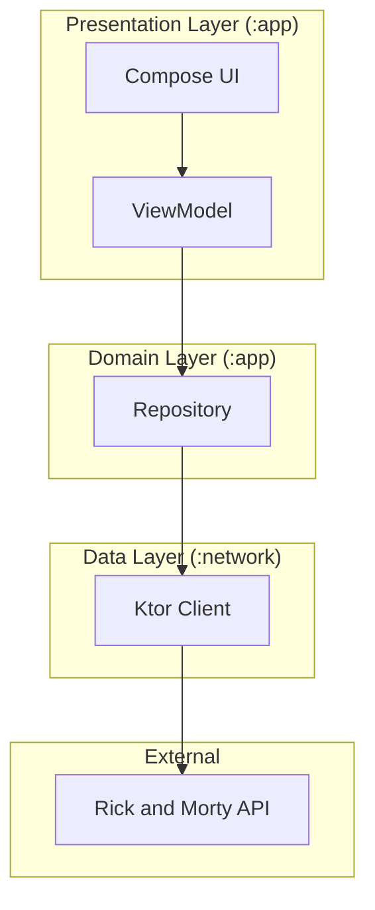

# Dimension35c

Dimension35c is a modern Android application built to showcase a clean, multi-module architecture and the latest Android development best practices. It serves as a client for the public [Rick and Morty API](https://rickandmortyapi.com/), allowing users to explore characters and episodes from the show.

This project is intended for software engineers and the open-source community to serve as a reference for building robust and scalable Android applications.

## Architecture

The application follows the principles of Clean Architecture, separating concerns into distinct layers to create a decoupled, testable, and maintainable codebase.

### Architecture Diagram



### Multi-Module Structure

The project is divided into two primary modules:

- **`:app`**: The main application module that contains the UI and presentation logic. It is built entirely with Jetpack Compose and uses ViewModels for state management. This module is responsible for observing data streams and rendering the UI accordingly.
- **`:network`**: A self-contained Android library module responsible for all communication with the Rick and Morty API. It has no dependencies on the `:app` module and can be reused in other projects.

This modular approach enforces separation of concerns, improves build times, and allows for independent development and testing of different layers.

### Layers

1.  **Data Layer (`:network` module)**

    - **Networking**: Uses [Ktor](https://ktor.io/) for making HTTP requests to the API.
    - **Data Serialization**: Uses [`kotlinx.serialization`](https://github.com/Kotlin/kotlinx.serialization) to parse JSON responses into Kotlin objects.
    - **Model Mapping**: A key feature of this layer is the mapping of `Remote` models (which directly reflect the API's JSON structure) to clean `Domain` models. This ensures that the rest of the application is shielded from any changes in the API and works with type-safe, clean data.
    - **Error Handling**: API calls are wrapped in a custom `ApiOps` sealed interface (`Made` or `Failed`), providing a robust and predictable way to handle network errors.

2.  **Domain Layer (Implicit)**

    - **Repositories**: The `CharacterRepository` and `EpisodesRepository` act as a facade, providing a single source of truth for data. They abstract the data source (the `KtorClient`) from the presentation layer.
    - **Domain Models**: Simple, immutable data classes (e.g., `Dimension34cCharacter`, `Episode`) represent the core business objects of the application.

3.  **Presentation Layer (`:app` module)**
    - **UI**: The entire UI is built with [Jetpack Compose](https://developer.android.com/jetpack/compose), creating a modern, declarative, and reactive user interface.
    - **State Management**: [ViewModels](https://developer.android.com/topic/libraries/architecture/viewmodel) are used to manage UI state. They fetch data from the repositories and expose it to the UI using Kotlin's `StateFlow`.
    - **Dependency Injection**: [Hilt](https://developer.android.com/training/dependency-injection/hilt-android) is used to manage dependencies throughout the application, making the code more modular and testable.

## Screenshots

|                                 Light Theme                                 |                                Dark Theme                                 |
| :-------------------------------------------------------------------------: | :-----------------------------------------------------------------------: |
|                                **Home Page**                                |                               **Home Page**                               |
|                |                |
|                              **Details Page**                               |                             **Details Page**                              |
|  |  |
|                               **Search Page**                               |                              **Search Page**                              |
|              |              |
|                              **Episodes Page**                              |                             **Episodes Page**                             |
|            |            |

## How to Build

To build and run the project, you will need Android Studio.

1.  Clone the repository:
    ```bash
    git clone https://github.com/ansgrb/Dimension35c.git
    ```
2.  Open the project in Android Studio.
3.  Let Gradle sync and download the required dependencies.
4.  Run the `app` configuration on an Android emulator or a physical device.

## Acknowledgements

This project would not be possible without the incredible [Rick and Morty API](https://rickandmortyapi.com/) created by [Axel Fuhrmann](https://github.com/afuh). A huge thank you for providing this amazing resource to the developer community.
